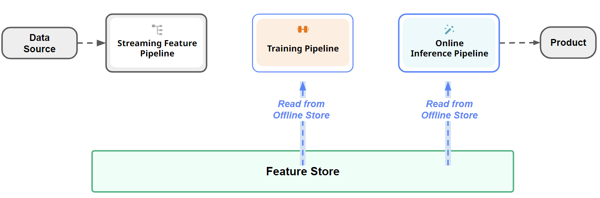
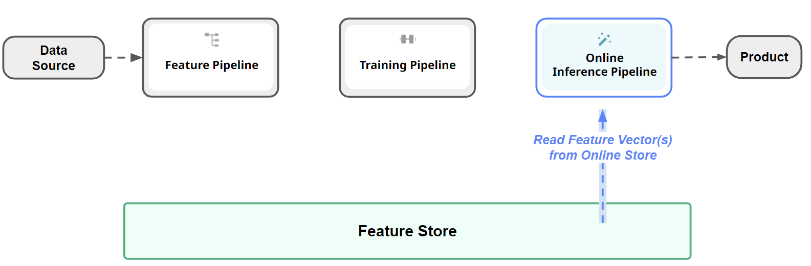
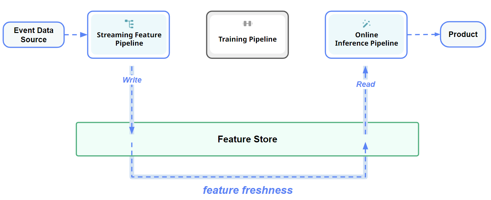

# Feature Store Benchmarks

Feature stores are a new category of data platform that manages data for model training and inference. We believe that benchmarks are important for feature stores as:

 * benchmarks are good way to measure progress in a field;
 * faster feature stores will change how users work with data in AI, enabling more data-centric AI engineering.

The benchmark results presented here should follow [these database benchmarking principles](https://hannes.muehleisen.org/publications/DBTEST2018-performance-testing.pdf):

 * Reproducibility - you should be able to easily setup the feature store and re-run the source code provided in this repository
 * Fairness - there should be no cherry-picking of results, hidden configuration parameters, unrealistic workload tuning,
 * Realistic Workloads - the workloads benchmarked should be typical for the use of feature stores in the wild.

Feature stores have 2 main APIs that are included in the benchmarks::

 * Offline API for creating point-in-time consistent snapshots of feature data for training and batch inference,
 * Online API for retrieving precomputed features for individual entities or groups of entities.

These benchmarks are not general purpose AI benchmarks (such as [TPCx-AI](https://www.tpc.org/tpcx-ai/TPCx-AI_An_Introduction_v1.3.0.pdf])) that cover video, image, and text data and model training. They are primarily for writing and reading structured data to/from the feature store. Reading from a feature store uses either the Offline or Online API.

## Offline API Benchmark

[Click here to go to the Offline Read Benchmark Results](https://github.com/featurestoreorg/featurestore-benchmarks/tree/main/fs-offline-benchmark#read-pandas-dataframe-benchmarks)

We have defined benchmarks for two common use cases in training pipelines for Offline data:

 * create training data as Pandas DataFrames,
 * create training data as files.

We provide two versions of the above experiments scenarios: 

 * read data from a single feature group,
 * read from from 3 feature groups with a point-in-time Join.

We use the NYC taxi dataset for these benchmarks, due to its reasonable size (~3 GBs) and widespread use to 
benchmark the performance of columnar datastores.

The potential performance bottlenecks that influence the Offline API experiments include:

 * reading from the (data warehouse) tables;
 * transferring data to Python clients over the network;; 
 * point-in-time correct joins of features across different feature groups;
 * the ablility to push down filters/queries when reading data to reduce the amount of data read/processed.

## Online API Benchmark

[Click here to go to the Online Read Benchmark Results](https://github.com/featurestoreorg/featurestore-benchmarks/tree/main/fs-online-benchmark#benchmark-results)

We have defined benchmarks for the following use cases:
 * reading a row of precomputed features for a given entity, e.g., a user_id to read precomputed features for a user.
 * reading a batch of rows of precomputed features for a given set of entites, e.g., the client provides a list of N user_id values and 
   N rows of precomputed feature values is returned.
 * feature freshness for streaming feature writes (how long does it take from when an event arrives at a message broker, until the corresponding feature value has been updated and is available for reading from the online feature store).

The potential performance bottlenecks that influence the Online API experiments include:

 * reading from the (row-oriented / key-value) tables;
 * joins of features across different feature groups (is this done serially or in parallel (is it pushed down to the database).

Online benchmarks are aimed at real-time ML systems that have hard SLAs for making predictions. For example, maybe your personalized
recommendations service has a SLA of 100ms before it returns the list of personalized ads. Such systems can generate between 100-500 candidates (e.g., using a vector database), requiring a batch lookup of 100-500 rows of feature values from the online feature store.

## Feature Freshness Benchmark

[Click here to go to the Feature Freshness Benchmark Results](https://github.com/featurestoreorg/featurestore-benchmarks/tree/main/fs-feature-freshness-benchmark#results)

We have defined a benchmark for the following use case:
 * streaming feature pipeline creates features from streaming event data (e.g., Kafka or Kinesis) and writes them to the online feature store
 * an online feature store client reads precomputed features, created by the streaming feature pipeline
 * measure the time take from when the event data arrives in the message bus (e.g., Kafka) and when the features computed from the event(s) are available for reading by the online feature store client.

The potential performance bottlenecks that influence the feature freshness experiments include:

 * latency of the streaming feature pipeline (e.g., per-key streaming (Flink) vs micro-batch (Spark))
 * time taken to write features in the online store that are then made available for reading by clients.

## Platforms included in this Benchmark

The first feature stores evaluated were chosen because they were (1) reproducible - you can create an account and re-run the code to reproduce the results, (2) they have a ready-to-use feature store (not a virtual feature store). We gladly receive contributions for new feature stores, DeWitt Clause permitting. See how to contribute, below, for how to add a new feature store.

The [DeWitt Clause](https://cube.dev/blog/dewitt-clause-or-can-you-benchmark-a-database?source=techstories.org) is a legal clause included in the terms of service of data platforms that is designed to prevent the benchmarking of a vendor's database. The following is our analysis of the terms of service of the benchmarked feature stores.

**AWS**
You may perform benchmarks or comparative tests or evaluations (each, a “Benchmark”) of the Services. If you perform or disclose, or direct or permit any third party to perform or disclose, any Benchmark of any of the Services, you (i) will include in any disclosure, and will disclose to us, all information necessary to replicate such Benchmark, and (ii) agree that we may perform and disclose the results of Benchmarks of your products or services, irrespective of any restrictions on Benchmarks in the terms governing your products or services.

**Databricks**
You may perform benchmarks or comparative tests or evaluations (each, a “Benchmark”) of the Platform Services and may disclose the results of the Benchmark other than for Beta Services. If you perform or disclose, or direct or permit any third party to perform or disclose, any Benchmark of any of the Platform Services, you (i) will include in any disclosure, and will disclose to us, all information necessary to replicate such Benchmark, and (ii) agree that we may perform and disclose the results of Benchmarks of your products or services, irrespective of any restrictions on Benchmarks in the terms governing your products or services.

**Hopsworks**
You may perform benchmarks or comparative tests or evaluations (each, a “Benchmark”) of the Platform Services and may disclose the results of the Benchmark other than for Beta Services. If you perform or disclose, or direct or permit any third party to perform or disclose, any Benchmark of any of the Platform Services, you (i) will include in any disclosure, and will disclose to us, all information necessary to replicate such Benchmark, and (ii) agree that we may perform and disclose the results of Benchmarks of your products or services, irrespective of any restrictions on Benchmarks in the terms governing your products or services.

**GCP**
In general, GCP does not allow benchmarking of their services. However, as of October 2nd 2023, there is no DeWitt Clause included for the feature store service. There are DeWitt clauses for BigQuery, BigTable, and other platforms, but not the feature store. As of Oct 11th 2023, there is a preview version of a new version of their feature store based on BigTable, which based on our analysis is covered by the DeWitt Clause.

**Feast**
We would welcome contributions for benchmarks with Feast. Feast does not include a production-quality offline or online store. Instead, you have to configure and install external stores. To the best of our knowledge, there are no existing benchmarks for Feast's offline store. There is, however, a [benchmark of the online store for Astra, Redis, and Dynamo available here](https://feast.dev/blog/performance-test-for-python-based-feast-feature-server/). In contrast with our benchmark, this benchmark is not based on a well-known dataset with mixed data types, but rather uses 50 integer features. 

## Discussion

Please discuss these feature store benchmarks on the [featurestore.org slack channel](https://featurestoreorg.slack.com/join/shared_invite/zt-ssh8dec1-IsvwLdTsRMssjT4~Ru2RKg#/shared-invite/email).

## How to Contribute

Feel free to create a PR to add a new feature store or benchmark. Be sure to include all the hardware setup and software version numbers, that should be as close as possible to existing benchmarks to ensure apple-to-apple comparisons. For virtual feature stores, include the automated complete setup of the feature store plus online and offline stores.

## Contact

 * Online Benchmarks: Dhananjay Mukhedkar <dhananjay.mukhedkar@ki.se> 
 * Offline Benchmarks: Ayushman Khazanchi <ayushman@kth.se>
 * Feature Freshness Benchmarks: Davit Bzhalava <davit@hopsworks.ai>

