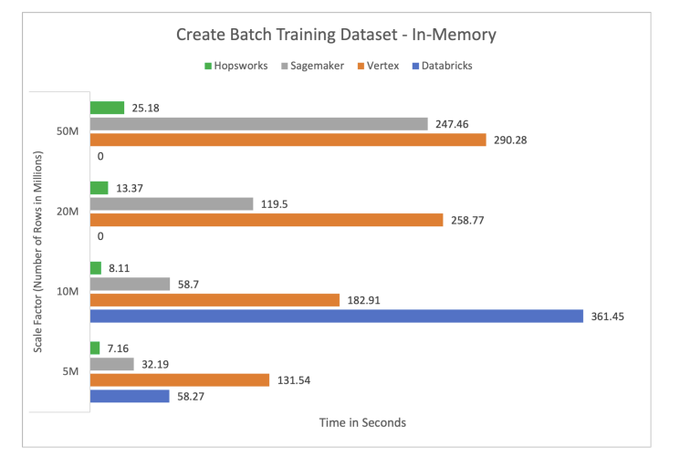
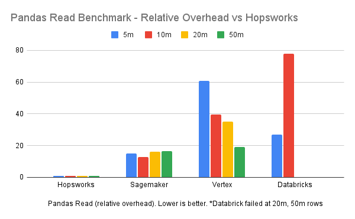
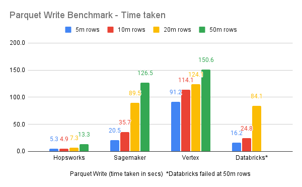
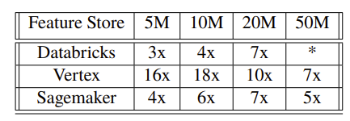
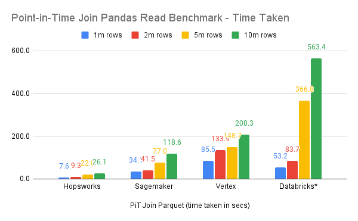
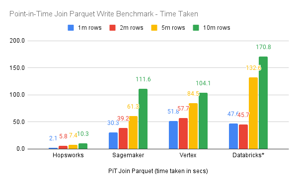
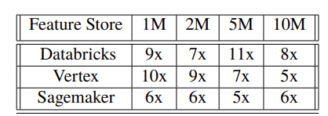

# Feature Store Offline API Read Benchmarks

[ Diagram of the 3-phase Pipeline, highlighting what we are benchmarking]

## Benchmarked Feature Stores

The current feature stores benchmarked here are:

 * Hopsworks Feature Store, version 3.4
 * Vertex Feature Store, version X
 * Databricks Feature Store, version
 * Sagemaker Feature Store, version 

# How to run the Benchmarks

Run the notebooks included here in Hopsworks Jupyter, Databricks, Sagemaker Jupyterlab, Vertex Notebooks.

# Benchmark Setup

Hardware setup for feature stores used in benchmarks

We use orginal data is NYC Taxi Trip data is available as files stored in the Parquet format, and is published monthly (with a 2 month delay).
Datasets used for offline read benchmarks

# Read Pandas DataFrame Benchmarks

# Create Parquet Training Data as Files Benchmark

# Pandas Point-in-Time Join Benchmark

# Create Parquet Training Data with Point-in-Time Join Benchmark

