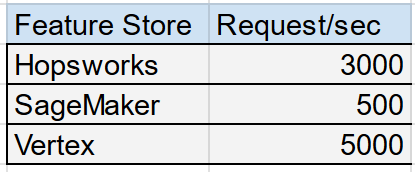

# Feature Store Online Read Latency

In this benchmark, we measure the read **50, 90, 95, and 99 percential latencies** for reading from an online feature store, when reading individual feature vectors and batches of feature vectors.

## Benchmarked Feature Stores

The current feature stores benchmarked here are:

 * Hopsworks Feature Store, version 3.4
 * Vertex Feature Store (Legacy), version (September 2023)
 * Sagemaker Feature Store, version  (September 2023)

(We did not benchmark Databricks Feature Store, because Databricks Feature Store as of now does not have a public API for reading online table. Reading online data can instead be done by querying its underlyging online database provider e.g. AWS, Azure).

# How to run the Benchmarks

We use locust framework for load testing. The locustfiles can be launched on a client machine. It can launched either as a standlone process or in distributed mode using docker. Individual feature store specific instructions can be found under its sub-directory. For Hopsworks Featue Store we used locust framework as part of its feature store API [git repo](https://github.com/logicalclocks/feature-store-api/tree/master/locust_benchmark).

# Benchmarking setup
The client VMs used for running locusts are as shown here

We run the test using the default settings and configuration available by each feature store. 

We ran the load tests with a throughput which was stable across all feature stores without causing excessive load on the client VMs.

#### Locust parameters
- Number of users=100
- Test duration=15 minutes
- Read request batch size= 1,100,250,500
- Locust workers=32
- Spawn rate=1

#### Data
 We used a small subset of NYC taxi data with 500 records.

#### Batch size limits and soft quotas

Every feature store as a different limit/soft quotas on the maximum batch size for each read request. Particulary for this test the relevant are that Vertex and SageMaker have a default limit of **100** records for each request. More details about quotas and limits, for 
[SageMaker](https://docs.aws.amazon.com/sagemaker/latest/dg/feature-store-quotas.html) and [Vertex FeatureStore](https://cloud.google.com/vertex-ai/docs/quotas#featurestore).

#### Maximum throughput limits

As per the default quotas and limits, the maximum request per second for the batch read APIs are as follows. 

# Benchmark Results

Following were the latencies as reported in locust results. Note, that as the default maximum batch size for Vertex and SageMaker are 100, consequently to estimate the results of batch size 250 and 500 we scale the results of lantecies in batch size 100 by 3 and 5 times respectively.

- Latencies for batch size=1 (single feature vector)

- Latencies for batch size=100

 

- Latencies for batch size=250

- Latencies for batch size=500

